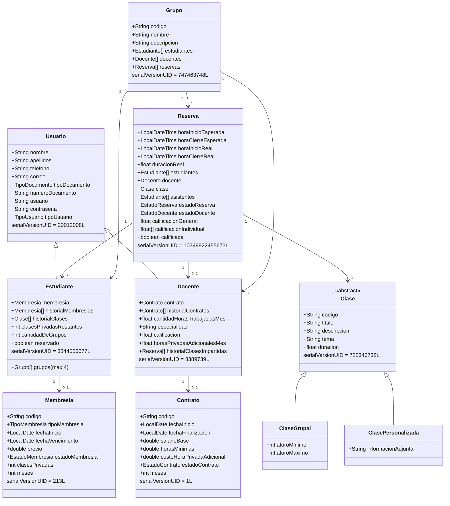

`AcademiaController` es la raíz del modelo. Contiene arreglos de todas las demás entidades y expone los métodos de negocio que las operan.

```java
public class AcademiaController {
    private String nit;
    private String nombre;
    private String telefono;
    private double capital;
    private String correo;
    private Usuario[]   usuarios;    // Administradores
    private Estudiante[] estudiantes;
    private Docente[]    docentes;
    private Reserva[]    reservas;
    private Grupo[]      grupos;
    private final String base = "datos/";
}
```

---

## Jerarquía de entidades



---

## Entidades

<AccordionGroup>

<Accordion title="Usuario (base)">

**Paquete:** `com.nousacademy.usuarios`  
**Implementa:** `Serializable`  
**serialVersionUID:** `20012008L`

Clase base para todos los usuarios del sistema. Al construirse, el `tipoUsuario` es `ADMINISTRADOR` por defecto; las subclases lo sobreescriben.

| Campo | Tipo | Descripción |
|---|---|---|
| `nombre` | `String` | Nombre de pila. Mínimo 2 caracteres. |
| `apellidos` | `String` | Apellidos. Mínimo 2 caracteres. |
| `telefono` | `String` | Teléfono. Mínimo 5 dígitos, valor no negativo. |
| `correo` | `String` | Correo institucional. Debe contener `@` y terminar en `nousacademy.co`. |
| `tipoDocumento` | `TipoDocumento` | Enum: tipo de documento de identidad. |
| `numeroDocumento` | `String` | Número de documento. Mínimo 5 caracteres, valor no negativo. |
| `usuario` | `String` | Nombre de usuario para login. |
| `contrasena` | `String` | Contraseña. |
| `tipoUsuario` | `TipoUsuario` | Rol: `ADMINISTRADOR`, `ESTUDIANTE` o `DOCENTE`. |

```java
public static final long serialVersionUID = 20012008L;

public Usuario(String nombre, String apellidos, String telefono, String correo,
               TipoDocumento tipoDocumento, String numeroDocumento,
               String usuario, String contrasena)
        throws ElementosVacios, NombreNoValido, CorreoNoValido,
               ValoresNegativos, LongitudNoValida
```

</Accordion>

<Accordion title="Estudiante extends Usuario">

**Paquete:** `com.nousacademy.usuarios`  
**Implementa:** `Serializable`  
**serialVersionUID:** `3344556677L`

Extiende `Usuario`. Al crearse, `tipoUsuario` se establece en `ESTUDIANTE`. Los atributos de membresía y grupos se asignan posteriormente mediante métodos del controlador.

| Campo | Tipo | Descripción |
|---|---|---|
| `membresia` | `Membresia` | Membresía activa actual. `null` si no tiene. |
| `historialMembresias` | `Membresia[]` | Membresías anteriores (canceladas). |
| `historialClases` | `Clase[]` | Clases en las que el estudiante está o estuvo inscrito. |
| `clasesPrivadasRestantes` | `int` | Créditos de clases privadas disponibles según la membresía activa. |
| `grupos` | `Grupo[]` | Grupos a los que pertenece. Máximo 4. |
| `cantidadDeGrupos` | `int` | Cantidad actual de grupos (se sincroniza con `grupos.length`). |
| `reservado` | `boolean` | `true` cuando tiene una reserva pendiente o en curso. |

```java
public static final long serialVersionUID = 3344556677L;

public Estudiante(String nombre, String apellidos, String telefono, String correo,
                  TipoDocumento tipoDocumento, String numeroDocumento,
                  String usuario, String contrasena)
        throws ElementosVacios, CorreoNoValido, NombreNoValido,
               ValoresNegativos, LongitudNoValida
```

</Accordion>

<Accordion title="Docente extends Usuario">

**Paquete:** `com.nousacademy.usuarios`  
**Implementa:** `Serializable`  
**serialVersionUID:** `8389739L`

Extiende `Usuario`. Al crearse, `tipoUsuario` se establece en `DOCENTE`. El contrato y el historial de clases impartidas se asignan mediante el controlador.

| Campo | Tipo | Descripción |
|---|---|---|
| `contrato` | `Contrato` | Contrato activo actual. `null` si no tiene. |
| `historialContratos` | `Contrato[]` | Contratos anteriores (finalizados). |
| `cantidadHorasTrabajadasMes` | `float` | Horas acumuladas en el mes en curso. |
| `especialidad` | `String` | Área de especialidad del docente. Campo obligatorio. |
| `calificacion` | `float` | Promedio de calificaciones recibidas en reservas calificadas. |
| `horasPrivadasAdicionalesMes` | `float` | Horas privadas adicionales dictadas en el mes. |
| `historialClasesImpartidas` | `Reserva[]` | Reservas asignadas al docente. |

```java
private static final long serialVersionUID = 8389739L;

public Docente(String nombre, String apellidos, String telefono, String correo,
               TipoDocumento tipoDocumento, String numeroDocumento,
               String usuario, String contrasena, String especialidad)
        throws ElementosVacios, CorreoNoValido, NombreNoValido,
               ValoresNegativos, LongitudNoValida
```

</Accordion>

<Accordion title="Clase (abstracta)">

**Paquete:** `com.nousacademy.modelo`  
**Implementa:** `Serializable`  
**serialVersionUID:** `725346738L`

Clase abstracta que define los atributos comunes de todas las clases académicas. El código se genera en el constructor a partir de un sufijo definido por la subclase (`PB` para grupal, `PV` para personalizada).

| Campo | Tipo | Descripción |
|---|---|---|
| `codigo` | `String` | Código único autogenerado (p. ej., `PB-001`). |
| `titulo` | `String` | Título de la clase. |
| `descripcion` | `String` | Descripción de contenido. |
| `tema` | `String` | Tema o área temática. |
| `duracion` | `float` | Duración en minutos. |

```java
public static final long serialVersionUID = 725346738L;

public Clase(String titulo, String descripcion, String tema,
             float duracion, String sufijo)
        throws ElementosVacios
```

**Subclases:**

| Subclase | Campos adicionales | Sufijo de código |
|---|---|---|
| `ClaseGrupal` | `aforoMinimo`, `aforoMaximo` | `PB` → `PB-001` |
| `ClasePersonalizada` | `informacionAdjunta` | `PV` → `PV-001` |

</Accordion>

<Accordion title="Reserva">

**Paquete:** `com.nousacademy.modelo`  
**Implementa:** `Serializable`  
**serialVersionUID:** `10349922455673L`

Agrupa una `Clase`, sus `Estudiante[]` inscritos, el `Docente` asignado y el ciclo de vida completo de la sesión (inicio, finalización, calificación).

| Campo | Tipo | Descripción |
|---|---|---|
| `horaInicioEsperada` | `LocalDateTime` | Fecha y hora de inicio planificadas. Debe ser futura. |
| `horaCierreEsperada` | `LocalDateTime` | Se calcula como `horaInicioEsperada + duracion`. |
| `horaInicioReal` | `LocalDateTime` | Registrado al llamar `iniciarClase()`. |
| `horaCierreReal` | `LocalDateTime` | Registrado al llamar `finalizarClase()`. |
| `duracionReal` | `float` | Minutos reales de la sesión. |
| `estudiantes` | `Estudiante[]` | Estudiantes inscritos (reservados). |
| `asistentes` | `Estudiante[]` | Estudiantes que confirmaron asistencia con `unirseClase()`. |
| `docente` | `Docente` | Docente asignado. `null` hasta que se asigne. |
| `clase` | `Clase` | Objeto `ClaseGrupal` o `ClasePersonalizada` asociado. |
| `estadoReserva` | `EstadoReserva` | `PENDIENTE`, `EN_CURSO`, `LLENA`, `EXITOSA`, `PREMATURA`, `TARDE`, `CANCELADA`. |
| `estadoDocente` | `EstadoDocente` | `EN_ESPERA`, `ACEPTADA`. |
| `calificacionGeneral` | `float` | Promedio de `calificacionIndividual[]`. |
| `calificacionIndividual` | `float[]` | Calificación de cada asistente (rango 1–5). |
| `calificada` | `boolean` | `true` una vez que al menos un asistente ha calificado. |

```java
public static final long serialVersionUID = 10349922455673L;

// Constructor para clase grupal
public Reserva(LocalDateTime horaInicioEsperada, String titulo,
               String descripcion, String tema, float duracion,
               int aforoMin, int aforoMax)
        throws ElementosVacios, AforoIncompatible, FechaInvalida, ValoresNegativos

// Constructor para clase personalizada
public Reserva(LocalDateTime horaInicioEsperada, String titulo,
               String descripcion, String tema, float duracion, String info)
        throws ElementosVacios, FechaInvalida, ValoresNegativos
```

**Ciclo de vida del `estadoReserva`:**

```
PENDIENTE → LLENA      (al alcanzar aforoMaximo)
PENDIENTE → EN_CURSO   (al llamar iniciarClase(), dentro de la ventana permitida)
PENDIENTE → TARDE      (al llamar iniciarClase() con más de 10 min de retraso)
EN_CURSO  → EXITOSA    (al llamar finalizarClase() con duración suficiente)
EN_CURSO  → PREMATURA  (al llamar finalizarClase() con > 25 min de anticipación)
*         → CANCELADA  (cancelación administrativa o estudiante cancela ClasePersonalizada)
```

</Accordion>

<Accordion title="Grupo">

**Paquete:** `com.nousacademy.modelo`  
**Implementa:** `Serializable`  
**serialVersionUID:** `747463748L`

Colección que agrupa estudiantes, docentes y reservas bajo un mismo contexto académico. El código se autogenera con el prefijo `GRUP` (p. ej., `GRUP001`).

| Campo | Tipo | Descripción |
|---|---|---|
| `codigo` | `String` | Código único autogenerado (p. ej., `GRUP001`). |
| `nombre` | `String` | Nombre del grupo. Obligatorio. |
| `descripcion` | `String` | Descripción del grupo. Obligatorio. |
| `estudiantes` | `Estudiante[]` | Estudiantes miembros. |
| `docentes` | `Docente[]` | Docentes asignados al grupo. |
| `reservas` | `Reserva[]` | Reservas asociadas al grupo. |

```java
private static final long serialVersionUID = 747463748L;

public Grupo(String nombre, String descripcion) throws ElementosVacios
```

</Accordion>

<Accordion title="Membresia">

**Paquete:** `com.nousacademy.contabilidad`  
**Implementa:** `ComportamientoContable`, `Serializable`  
**serialVersionUID:** `213L`

Representa el plan de acceso de un estudiante. Existen dos variantes de construcción: **personalizada** (precio y clases privadas libres) y **definida** (precio y clases privadas fijados por `TipoMembresia`).

| Campo | Tipo | Descripción |
|---|---|---|
| `codigo` | `String` | Código autogenerado con prefijo `MEM` (p. ej., `MEM0001`). |
| `tipoMembresia` | `TipoMembresia` | `BASICA`, `INTENSIVA`, `PREMIUM` o `PERSONALIZADA`. |
| `fechaInicio` | `LocalDate` | Fecha de inicio. Debe ser hoy o futura. |
| `fechaVencimiento` | `LocalDate` | Se calcula como `fechaInicio + meses`. |
| `precio` | `double` | Precio total. Impacto comercial positivo en el capital. |
| `estadoMembresia` | `EstadoMembresia` | `EN_PROGRESO` o `CANCELADA`. |
| `clasesPrivadas` | `int` | Créditos de clases personalizadas incluidos. |
| `meses` | `int` | Vigencia en meses. |

**Precios y créditos por tipo predefinido (por mes):**

| Tipo | Precio/mes | Clases privadas/mes |
|---|---|---|
| `BASICA` | $1 200 000 | 0 |
| `INTENSIVA` | $2 200 000 | 4 |
| `PREMIUM` | $3 500 000 | 8 |

```java
private static final long serialVersionUID = 213L;

// Membresía personalizada
public Membresia(LocalDate fechaInicio, double precio,
                 int clasesPrivadas, int meses)
        throws FechaInvalida, ValoresNegativos

// Membresía definida
public Membresia(TipoMembresia tipoMembresia, LocalDate fechaInicio, int meses)
        throws TipoMembresiaInvalida, ValoresNegativos, FechaInvalida
```

</Accordion>

<Accordion title="Contrato">

**Paquete:** `com.nousacademy.contabilidad`  
**Implementa:** `ComportamientoContable`, `Serializable`  
**serialVersionUID:** `1L`

Representa el acuerdo laboral de un docente. El impacto comercial es **negativo** (`-salarioBase * meses`), lo que descuenta capital al asignarse.

| Campo | Tipo | Descripción |
|---|---|---|
| `codigo` | `String` | Código autogenerado con prefijo `CON` (p. ej., `CON001`). |
| `fechaInicio` | `LocalDate` | Fecha de inicio. Debe ser hoy o futura. |
| `fechaFinalizacion` | `LocalDate` | Se calcula como `fechaInicio + meses`. |
| `salarioBase` | `double` | Salario mensual base. Debe ser positivo. |
| `horasMinimas` | `double` | Horas mínimas contractuales por mes. |
| `costoHoraPrivadaAdicional` | `double` | Costo por hora adicional de clase privada. |
| `estadoContrato` | `EstadoContrato` | `ACTIVO` o `FINALIZADO`. |
| `meses` | `int` | Duración del contrato en meses. |

```java
private static final long serialVersionUID = 1L;

public Contrato(LocalDate fechaInicio, double salarioBase,
                double horasMinimas, double costoHoraPrivadaAdicional, int meses)
        throws FechaInvalida, ValoresNegativos
```

</Accordion>

</AccordionGroup>

---

## Enumeraciones

<Columns cols={2}>
  <Card title="TipoUsuario" icon="user">
    `ADMINISTRADOR` · `ESTUDIANTE` · `DOCENTE`
  </Card>
  <Card title="TipoDocumento" icon="id-card">
    Tipos de documento de identidad utilizados como clave de búsqueda y como prefijo del nombre de archivo de persistencia.
  </Card>
  <Card title="TipoMembresia" icon="credit-card">
    `BASICA` · `INTENSIVA` · `PREMIUM` · `PERSONALIZADA`
  </Card>
  <Card title="EstadoMembresia" icon="circle-check">
    `EN_PROGRESO` · `CANCELADA`
  </Card>
  <Card title="EstadoContrato" icon="file-contract">
    `ACTIVO` · `FINALIZADO`
  </Card>
  <Card title="EstadoReserva" icon="calendar">
    `PENDIENTE` · `EN_CURSO` · `LLENA` · `EXITOSA` · `PREMATURA` · `TARDE` · `CANCELADA`
  </Card>
  <Card title="EstadoDocente" icon="chalkboard-teacher">
    `EN_ESPERA` · `ACEPTADA`
  </Card>
</Columns>
